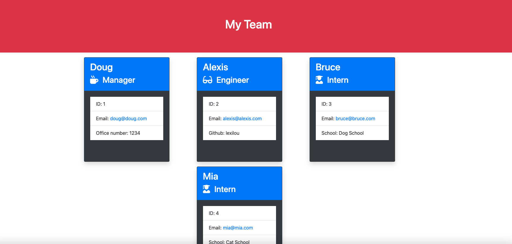
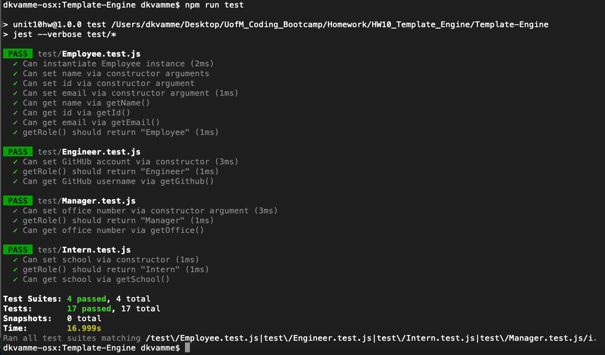

<h1 align="center">Unit 10 OOP Homework: Template Engine - Employee Summary</h1>

## Table of Contents

- [Description](#description)
- [Installation](#installation)
- [Usage](#usage)
- [Contributing](#contributing)
- [Questions](#questions)

## Description

This is a node CLI that prompts a user to input data about their software engineering team and will output an HTML webpage that displays a summary of each person on the team.  The application collects information from the user via inquirer and was tested using jest.  I used test-driven development to ensure all new code commited would pass each of the 17 tests that were provided for this project.

The completed teamPage.html can be found in the output folder.

Gif showing the functionality of the application:

The full movie file showing functionality of the application can be found [here](./src/te.mp4)

Screenshot of the completed output:

## Installation

`npm init`

`npm install inquirer`

`npm install jest`

## Usage

Run the following command at the root of your project and you will be prompted with questions:

`node app.js`

Run the following command at the root of your project and you will get the results of the tests:

`npm run test`

Screenshot of the completed tests:

## Contributing

:octocat: [Doug Kvamme](https://github.com/kvadou)

## Questions

Contact me with any questions: [email](mailto:dougkvamme@gmail.com) , [GitHub](https://github.com/kvadou) 
